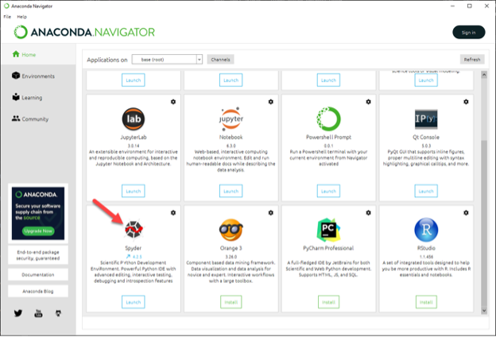
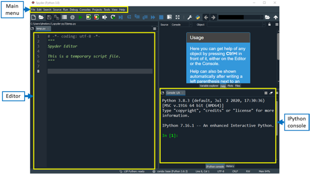

Many software developers will often use an integrated development environment (IDE) or a text editor to create and edit their Python programs which can be executed through the IDE or command line directly. 

[Spyder](https://www.spyder-ide.org) (Scientific Python Development Environment) is a free IDE written in Python that comes with Anaconda. Editing, interactive testing, debugging, and introspection tools are all included in Spyder. 

This has several advantages:
  *   You will become familiar with using an IDE.
  *   Tab complete allows you to easily access the names of things you are using
      and learn more about them.
  *   You will be able to run your code as you create it and see results within the one interface.
  *   You will be able to easily run you scripts from the command line after you have finished writing them..

Each file can contain one or more cells that contain code and comments (documentation).

In this workshop, we will use Spyder to understand the fundamentals of programming with Python. We will also undertake various plotting exercises for our dataset.

> ## First steps with Spyder
> 
> If you are new to Spyder, we highly recommend watching this set of informative
> videos, [Spyder Tutorials](https://youtu.be/E2Dap5SfXkI). Each video is about 3.5
> minutes long.
> 
{: .callout}

## Getting Started with Spyder

Spyder is included as part of the Anaconda Python distribution. If you have not already
installed the Anaconda Python distribution, see [the setup instructions]({{ page.root }})
for installation instructions.

## Starting Spyder

You can start the Spyder IDE through the command line or through an application called 
`Anaconda Navigator`. Anaconda Navigator is included as part of the Anaconda Python distribution.

### macOS - Command Line
To start Spyder IDE you will need to access the command line through the Terminal. 
There are two ways to open Terminal on Mac.

1. In your Applications folder, open Utilities and double-click on Terminal
2. Press <kbd>Command</kbd> + <kbd>spacebar</kbd> to launch Spotlight. Type `Terminal` and then 
double-click the search result or hit <kbd>Enter</kbd>

After you have launched Terminal, type the command to launch the Spyder IDE.

~~~
$ spyder
~~~
{: .language-bash}

### Windows Users - Command Line
To start the Spyder IDE you will need to access the Anaconda Prompt.

Press <kbd>Windows Logo Key</kbd> and search for `Anaconda Prompt`, click the result or press enter.

After you have launched the Anaconda Prompt, type the command:

~~~
$ spyder
~~~
{: .source}

###  Anaconda Navigator

To start a Spyder IDE from Anaconda Navigator you must first [start Anaconda Navigator (click for detailed instructions on macOS, Windows, and Linux)](https://docs.anaconda.com/anaconda/navigator/getting-started/#starting-navigator). You can search for Anaconda Navigator via Spotlight on macOS (<kbd>Command</kbd> + <kbd>spacebar</kbd>), the Windows search function (<kbd>Windows Logo Key</kbd>) or opening a terminal shell and executing the `anaconda-navigator` executable from the command line.

After you have launched Anaconda Navigator, click the `Launch` button under Spyder. You may need
to scroll down to find it.

Here is a screenshot of an Anaconda Navigator page similar to the one that should open on either macOS
or Windows.

  

## The Spyder IDE Interface

You will see a toolbar and 3 panes when you first open Spyder. Working clockwise, the 3 panes are:

* Editor, 
* Help, Variable Explorer, Plots, Files, and 
* the IPython Console.

  

 Maybe redo the screen shot to include the toolbar rather than the menu and include the Variable Explorer etc pane. Resolution looks a bit low but that could be a result of the embedding in the Word document.  

The menu on Macs is the same with the usual macOS variations, e.g., `Preferences` can be found under the Code menu item rather than under the Tools menu item as in Windows.

### Editor (left panel)
* The Editor pane is where we can view and write our Python code.
* We can use the toolbar or menu to create, open and save files containing Python code in the editor.
* In the Editor pane you will get syntax highlighting, on-demand completion and other helpful features.

### Variable Explorer, Help, Plots and Files (top right panel)
This panel has 4 tabs by default.
* **Variable Explorer** shows the values of all of the variables you create by running Python code.
* **Help** help information requested from the Editor or IPython pane is displayed here.
* **Plots** plots created by running code are displayed here.
* **Files** displays and Explorer/Finder view so that you can easily see where your files are.

### IPython Console (bottom right)
This pane has 2 tabs; IPython console and History, by default.
* **IPython console** is an interactive contole/terminal which displays the content output by your code. You can also run Python commands in it interactively, separately from your code.
* **History** displays a list of commands that you have typed into the Console or run from the Editor.

> ##  Spyder IDE Documentation
> 
> More information on the Spyder IDE can be found at [spyder docs](https://docs.spyder-ide.org/current/index.html). 
> 
{: .callout}

27-July-2022 Pauline got up to here

## Running Programs in Spyder

Before you run your program in Spyder, it is essential to know your working directory.You can find this by looking at the path next to the folder icon in the top right of the Help section. To select a different working directory you can click on the folder icon and choose a different one.

Insert screen shot here working dir

We can run programs in Spyder in two ways: line by line or the entire code at the same time.
*   Type F5 to run the entire program 
*   Type Ctrl + Enter (in Windows) or Control + Enter (In Mac) to run code one line at a time.

Note: It is advisable to run the entire program as it helps in identifying and debugging errors easily.

Visit the [Spyder Key Combinations](https://keycombiner.com/collections/spyder/) web page for more keyboard shortcuts.

## Sample Code Examples

## Assign values to variables, print the variable and get the type
~~~
text = “Getting started with Spyder” # string
print(text)
type(text)
~~~
{: .language-python}

~~~
“Getting started with Spyder”
<class ‘str’>
~~~
{: .output}

~~~
number = 75 # integer
print(number)
type(number)
~~~
{: .language-python}

~~~
75
<class ‘int’>
~~~
{: .output}

~~~
prob = 0.975 # float
print(prob)
type(prob)
~~~
{: .language-python}

~~~
0.975
<class ‘float’>
~~~
{: .output}

## Using Spyder as a calculator
~~~
3 + 2 # Addition
5 * 6 # Multiplication
2 ** 3 # Power
~~~
{: .language-python}

~~~
5
30
8
~~~
{: .output}

## Comparison and logic operators
~~~
5 > 4 # Greater than
3 == 3  # Equal to
7 != 6  # Not Equal to

~~~
{: .language-python}

~~~
False
True
True
~~~
{: .output}