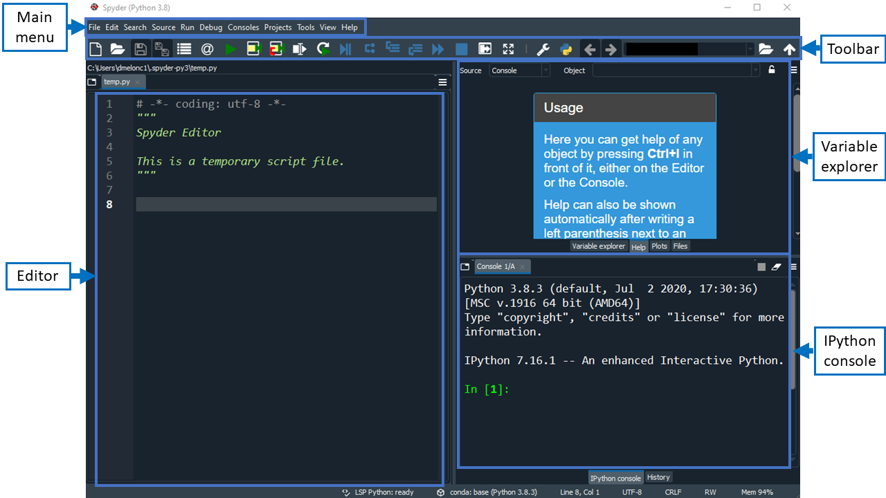

Many software developers will often use an integrated development environment (IDE) or a text editor to create and edit their Python programs which can be executed through the IDE or command line directly. 

[Spyder](https://www.spyder-ide.org) (Scientific Python Development Environment) is a free IDE written in Python that comes with Anaconda. Editing, interactive testing, debugging, and introspection tools are all included in Spyder. 

This has several advantages:
  *   You will become familiar with using an IDE.
  *   Tab complete allows you to easily access the names of things you are using
      and learn more about them.
  *   You will be able to run your code as you create it and see results within the one interface.
  *   You will be able to easily run you scripts from the command line after you have finished writing them..

Each file can contain one or more cells that contain code and comments (documentation).

In this workshop, we will use Spyder to understand the fundamentals of programming with Python. We will also undertake various plotting exercises for our dataset.

> ## First steps with Spyder
> 
> If you are new to Spyder, we highly recommend watching this set of informative
> videos, [Spyder Tutorials](https://youtu.be/E2Dap5SfXkI). Each video is about 3.5
> minutes long.
> 
{: .callout}

## Getting Started with Spyder

Spyder is included as part of the Anaconda Python distribution. If you have not already
installed the Anaconda Python distribution, see [the setup instructions]({{ page.root }})
for installation instructions.

## Starting Spyder

You can start the Spyder IDE through the command line or through an application called 
`Anaconda Navigator`. Anaconda Navigator is included as part of the Anaconda Python distribution.

### macOS - Command Line
To start Spyder IDE you will need to access the command line through the Terminal. 
There are two ways to open Terminal on Mac.

1. In your Applications folder, open Utilities and double-click on Terminal
2. Press <kbd>Command</kbd> + <kbd>spacebar</kbd> to launch Spotlight. Type `Terminal` and then 
double-click the search result or hit <kbd>Enter</kbd>

After you have launched Terminal, type the command to launch the Spyder IDE.

~~~
$ spyder
~~~
{: .language-bash}

### Windows Users - Command Line
To start the Spyder IDE you will need to access the Anaconda Prompt.

Press <kbd>Windows Logo Key</kbd> and search for `Anaconda Prompt`, click the result or press enter.

After you have launched the Anaconda Prompt, type the command:

~~~
$ spyder
~~~
{: .source}

###  Anaconda Navigator

To start a Spyder IDE from Anaconda Navigator you must first [start Anaconda Navigator (click for detailed instructions on macOS, Windows, and Linux)](https://docs.anaconda.com/anaconda/navigator/getting-started/#starting-navigator). You can search for Anaconda Navigator via Spotlight on macOS (<kbd>Command</kbd> + <kbd>spacebar</kbd>), the Windows search function (<kbd>Windows Logo Key</kbd>) or opening a terminal shell and executing the `anaconda-navigator` executable from the command line.

After you have launched Anaconda Navigator, click the `Launch` button under Spyder. You may need
to scroll down to find it.

Here is a screenshot of an Anaconda Navigator page similar to the one that should open on either macOS
or Windows.

  

## The Spyder IDE Interface

You will see a toolbar and 3 panes when you first open Spyder. Working clockwise, the 3 panes are:

* Editor, 
* Help, Variable Explorer, Plots, Files, and 
* the IPython Console.

  

 Maybe redo the screen shot to include the toolbar rather than the menu and include the Variable Explorer etc pane. Resolution looks a bit low but that could be a result of the embedding in the Word document.  

The menu on Macs is the same with the usual macOS variations, e.g., `Preferences` can be found under the Code menu item rather than  whereever it is in Windows .

### Editor (left panel)
* The Editor pane is where we can view and write our Python code.
* We can use the toolbar or menu to create, open and save files containing Python code in the editor.
* In the Editor pane you will get syntax highlighting, on-demand completion and other helpful features.

### Variable Explorer, Help, Plots and Files (top right panel)
This panel has 4 tabs by default.
* **Variable Explorer** shows the values of all of the variables you create by running Python code.
* **Help**, help information requested from the Editor or IPython pane is displayed here.
* **Plots**, plots created by running code are displayed here.
* **Files** displays and Explorer/Finder view so that you can easily see where your files are.

### IPython Console (bottom right)
This pane has 2 tabs; IPython console and History, by default.
* **IPython console** is an interactive contole/terminal which displays the content output by your code. You can also run Python commands in it interactively, separately from your code.
* **History** displays a list of commands that you have typed into the Console or run from the Editor.

> ##  Spyder IDE Documentation
> 
> More information on the Spyder IDE can be found at [spyder docs](https://docs.spyder-ide.org/current/index.html). 
> 
{: .callout}

27-July-2022 Pauline got up to here

## Creating a Python script

*   To start writing a new Python program click the Text File icon under the *Other* header in the Launcher tab of the Main Work Area.
    *   You can also create a new plain text file by selecting the *New -> Text File* from the *File* menu in the Menu Bar.
*   To convert this plain text file to a Python program, select the *Save File As* action from the *File* menu in the Menu Bar and give your new text file a name that ends with the `.py` extension.
    *   The `.py` extension lets everyone (including the operating system) know that this text file is a Python program.
    *   This is convention, not a requirement.

## Creating a Jupyter Notebook

To open a new notebook click the Python 3 icon under the *Notebook* header in the Launcher tab in 
the main work area. You can also create a new notebook by selecting *New -> Notebook* from the *File* menu in the Menu Bar.

Additional notes on Jupyter notebooks.

  *   Notebook files have the extension `.ipynb` to distinguish them from plain-text Python programs.
  *   Notebooks can be exported as Python scripts that can be run from the command line.

Below is a screenshot of a Jupyter notebook running inside JupyterLab. If you are interested in 
more details, then see the [official notebook documentation][jupyterlab-notebook-docs].

    

> ## How It's Stored
>
> *   The notebook file is stored in a format called JSON.
> *   Just like a webpage, what's saved looks different from what you see in your browser.
> *   But this format allows Jupyter to mix source code, text, and images, all in one file.
{: .callout}

> ## Arranging Documents into Panels of Tabs
>
> In the JupyterLab Main Work Area you can arrange documents into panels of tabs. Here is an 
> example from the [official documentation][jupyterlab].
> 
> 

>    
> 

>
> First, create a text file, Python console, and terminal window and arrange them into three 
> panels in the main work area. Next, create a notebook, terminal window, and text file and 
> arrange them into three panels in the main work area. Finally, create your own combination of 
> panels and tabs. What combination of panels and tabs do you think will be most useful for your 
> workflow?
>
> > ## Solution
> >
> > After creating the necessary tabs, you can drag one of the tabs to the center of a panel to 
> > move the tab to the panel; next you can subdivide a tab panel by dragging a tab to the left, 
> > right, top, or bottom of the panel.
> {: .solution}
{: .challenge}

> ## Code vs. Text
>
> Jupyter mixes code and text in different types of blocks, called cells. We often use the term
> "code" to mean "the source code of software written in a language such as Python".
> A "code cell" in a Notebook is a cell that contains software;
> a "text cell" is one that contains ordinary prose written for human beings.
{: .callout}

## The Notebook has Command and Edit modes.

*   If you press <kbd>Esc</kbd> and <kbd>Return</kbd> alternately, the outer border of your code cell will change from gray to blue.
*   These are the **Command** (gray) and **Edit** (blue) modes of your notebook.
*   Command mode allows you to edit notebook-level features, and Edit mode changes the content of cells.
*   When in Command mode (esc/gray),
    *   The <kbd>b</kbd> key will make a new cell below the currently selected cell.
    *   The <kbd>a</kbd> key will make one above.
    *   The <kbd>x</kbd> key will delete the current cell.
    *   The <kbd>z</kbd> key will undo your last cell operation (which could be a deletion, creation, etc).
*   All actions can be done using the menus, but there are lots of keyboard shortcuts to speed things up.

> ## Command Vs. Edit
>
> In the Jupyter notebook page are you currently in Command or Edit mode?  
> Switch between the modes. 
> Use the shortcuts to generate a new cell. 
> Use the shortcuts to delete a cell.
> Use the shortcuts to undo the last cell operation you performed.
>
> > ## Solution
> >
> > Command mode has a grey border and Edit mode has a blue border. 
> > Use <kbd>Esc</kbd> and <kbd>Return</kbd> to switch between modes. 
> > You need to be in Command mode (Press <kbd>Esc</kbd> if your cell is blue).  Type <kbd>b</kbd> or <kbd>a</kbd>.
> > You need to be in Command mode (Press <kbd>Esc</kbd> if your cell is blue).  Type <kbd>x</kbd>.
> > You need to be in Command mode (Press <kbd>Esc</kbd> if your cell is blue).  Type <kbd>z</kbd>.
> {: .solution}
{: .challenge}

### Use the keyboard and mouse to select and edit cells.

*   Pressing the <kbd>Return</kbd> key turns the border blue and engages Edit mode, which allows 
    you to type within the cell.
*   Because we want to be able to write many lines of code in a single cell,
    pressing the <kbd>Return</kbd> key when in Edit mode (blue) moves the cursor to the next line 
    in the cell just like in a text editor.
*   We need some other way to tell the Notebook we want to run what's in the cell.
*   Pressing <kbd>Shift</kbd>+<kbd>Return</kbd> together will execute the contents of the cell.
*   Notice that the <kbd>Return</kbd> and <kbd>Shift</kbd> keys on the right of the keyboard are 
    right next to each other.

### The Notebook will turn Markdown into pretty-printed documentation.

*   Notebooks can also render [Markdown][markdown].
    *   A simple plain-text format for writing lists, links, 
        and other things that might go into a web page.
    *   Equivalently, a subset of HTML that looks like what you'd send in an old-fashioned email.
*   Turn the current cell into a Markdown cell by entering the Command mode (<kbd>Esc</kbd>/gray) 
    and press the <kbd>M</kbd> key.
*   `In [ ]:` will disappear to show it is no longer a code cell and you will be able to write in 
    Markdown.
*   Turn the current cell into a Code cell by entering the Command mode (<kbd>Esc</kbd>/gray) and 
    press the <kbd>y</kbd> key.

### Markdown does most of what HTML does.

  

    
~~~
*   Use asterisks
*   to create
*   bullet lists.
~~~

  

  

  
*   Use asterisks
*   to create
*   bullet lists.

  

  

    
~~~
1.  Use numbers
1.  to create
1.  numbered lists.
~~~

  

  

1.  Use numbers
1.  to create
1.  numbered lists.

  

  

    
~~~
*  You can use indents
	*  To create sublists 
	*  of the same type
*  Or sublists
	1. Of different
	1. types
~~~

  

  

  
*  You can use indents
	*  To create sublists
	*  of the same type
*  Or sublists
	1. Of different
	1. types
  
  

  

    
~~~
# A Level-1 Heading
~~~

  

  

  
# A Level-1 Heading

  

  

    
~~~
## A Level-2 Heading (etc.)
~~~

  

  

  
## A Level-2 Heading (etc.)

  

  

    
~~~
Line breaks
don't matter.

But blank lines
create new paragraphs.
~~~

  

  

  
Line breaks
don't matter.

But blank lines
create new paragraphs.

  

  

    
~~~
[Create links](http://software-carpentry.org) with `[...](...)`.
Or use [named links][data_carpentry].

[data_carpentry]: http://datacarpentry.org
~~~

  

  

  
[Create links](http://software-carpentry.org) with `[...](...)`.
Or use [named links][data_carpentry].

[data_carpentry]: http://datacarpentry.org

  

> ## Creating Lists in Markdown
>
> Create a nested list in a Markdown cell in a notebook that looks like this:
>
> 1.  Get funding.
> 2.  Do work.
>     *   Design experiment.
>     *   Collect data.
>     *   Analyze.
> 3.  Write up.
> 4.  Publish.
> 
> > ## Solution
> >
> > This challenge integrates both the numbered list and bullet list. 
> > Note that the bullet list is indented 2 spaces so that it is inline with the items of the numbered list.
> > ~~~
> > 1.  Get funding.
> > 2.  Do work.
> >     *   Design experiment.
> >     *   Collect data.
> >     *   Analyze.
> > 3.  Write up.
> > 4.  Publish.
> > ~~~
> {: .solution}
{: .challenge}

> ## More Math
>
> What is displayed when a Python cell in a notebook
> that contains several calculations is executed?
> For example, what happens when this cell is executed?
>
> ~~~
> 7 * 3
> 2 + 1
> ~~~
> {: .language-python}
> 
> > ## Solution
> >
> > Python returns the output of the last calculation.
> > ~~~
> > 3
> > ~~~
> > {: .language-python}
> {: .solution}
{: .challenge}

> ## Change an Existing Cell from Code to Markdown
>
> What happens if you write some Python in a code cell
> and then you switch it to a Markdown cell?
> For example,
> put the following in a code cell:
>
> ~~~
> x = 6 * 7 + 12
> print(x)
> ~~~
> {: .language-python}
>
> And then run it with <kbd>Shift</kbd>+<kbd>Return</kbd> to be sure that it works as a code cell.
> Now go back to the cell and use <kbd>Esc</kbd> then <kbd>m</kbd> to switch the cell to Markdown
> and "run" it with <kbd>Shift</kbd>+<kbd>Return</kbd>.
> What happened and how might this be useful?
> 
> > ## Solution
> >
> > The Python code gets treated like Markdown text.
> > The lines appear as if they are part of one contiguous paragraph.
> > This could be useful to temporarily turn on and off cells in notebooks that get used for multiple purposes. 
> > ~~~
> > x = 6 * 7 + 12 print(x)
> > ~~~
> > {: .language-python}
> {: .solution}
{: .challenge}

> ## Equations
>
> Standard Markdown (such as we're using for these notes) won't render equations,
> but the Notebook will.
> Create a new Markdown cell
> and enter the following:
>
> ~~~
> $\sum_{i=1}^{N} 2^{-i} \approx 1$
> ~~~
>
> (It's probably easier to copy and paste.)
> What does it display?
> What do you think the underscore, `_`, circumflex, `^`, and dollar sign, `$`, do?
> 
> > ## Solution
> >
> > The notebook shows the equation as it would be rendered from LaTeX equation syntax.
> > The dollar sign, `$`, is used to tell Markdown that the text in between is a LaTeX equation.
> > If you're not familiar with LaTeX,  underscore, `_`, is used for subscripts and circumflex, `^`, is used for superscripts.
> > A pair of curly braces, `{` and `}`, is used to group text together so that the statement `i=1` becomes the subscript and `N` becomes the superscript.
> > Similarly, `-i` is in curly braces to make the whole statement the superscript for `2`.
> > `\sum` and `\approx` are LaTeX commands for "sum over" and "approximate" symbols. 
> {: .solution}
{: .challenge}

## Closing JupyterLab

*   From the Menu Bar select the "File" menu and then choose "Shut Down" at the bottom of the dropdown menu. You will be prompted to confirm that you wish to shutdown the JupyterLab server (don't forget to save your work!). Click "Shut Down" to shutdown the JupyterLab server.
*   To restart the JupyterLab server you will need to re-run the following command from a shell.

~~~
$ jupyter lab
~~~

> ## Closing JupyterLab
>
> Practice closing and restarting the JupyterLab server.
{: .challenge}

[anaconda]: https://docs.continuum.io/anaconda/install
[jupyterlab]: https://jupyterlab.readthedocs.io/en/stable/
[jupyterlab-ui]: https://jupyterlab.readthedocs.io/en/stable/user/interface.html
[jupyterlab-notebook-docs]: https://jupyterlab.readthedocs.io/en/stable/user/notebook.html
[markdown]: https://en.wikipedia.org/wiki/Markdown


